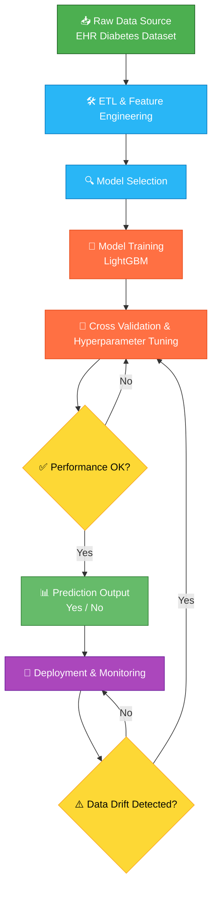
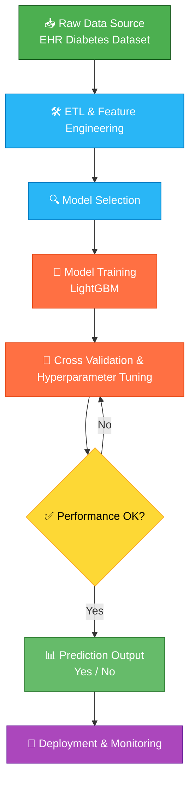

```mermaid
flowchart TD
    %% ===== Diabetic_High-Level E2E Data Flow with Drift Detection =====

    %% --- Nodes ---
    A[📥 Raw Data Source<br>EHR Diabetes Dataset]:::source
    B[🛠 ETL & Feature Engineering]:::process
    C[🔍 Model Selection]:::process
    D[🤖 Model Training<br>LightGBM]:::model
    E[🔁 Cross Validation & Hyperparameter Tuning]:::model
    F{✅ Performance OK?}:::decision
    G[📊 Prediction Output<br>Yes / No]:::output
    H[🚀 Deployment & Monitoring]:::monitor
    I{⚠️ Data Drift Detected?}:::decision

    %% --- Flow Arrows ---
    A --> B --> C --> D --> E --> F
    F -- "No" --> E
    F -- "Yes" --> G --> H

    %% Drift loop
    H --> I
    I -- "Yes" --> E
    I -- "No" --> H

    %% --- Node Styles ---
    classDef source fill:#4CAF50,stroke:#1B5E20,color:#fff;
    classDef process fill:#29B6F6,stroke:#0277BD,color:#fff;
    classDef model fill:#FF7043,stroke:#E64A19,color:#fff;
    classDef decision fill:#FDD835,stroke:#F9A825,color:#000;
    classDef output fill:#66BB6A,stroke:#2E7D32,color:#fff;
    classDef monitor fill:#AB47BC,stroke:#6A1B9A,color:#fff;
```

```mermaid   
flowchart TD
    %% ===== High-Level E2E Data Flow with Tuning & Monitoring =====

    %% --- Nodes ---
    A[📥 Raw Data Source<br>EHR Diabetes Dataset]:::source
    B[🛠 ETL & Feature Engineering]:::process
    C[🔍 Model Selection]:::process
    D[🤖 Model Training<br>LightGBM]:::model
    E[🔁 Cross Validation & Hyperparameter Tuning]:::model
    F{✅ Performance OK?}:::decision
    G[📊 Prediction Output<br>Yes / No]:::output
    H[🚀 Deployment & Monitoring]:::monitor

    %% --- Flow Arrows ---
    A --> B --> C --> D --> E --> F
    F -- "No" --> E
    F -- "Yes" --> G --> H

    %% --- Node Styles ---
    classDef source fill:#4CAF50,stroke:#1B5E20,color:#fff;
    classDef process fill:#29B6F6,stroke:#0277BD,color:#fff;
    classDef model fill:#FF7043,stroke:#E64A19,color:#fff;
    classDef decision fill:#FDD835,stroke:#F9A825,color:#000;
    classDef output fill:#66BB6A,stroke:#2E7D32,color:#fff;
    classDef monitor fill:#AB47BC,stroke:#6A1B9A,color:#fff;
```
